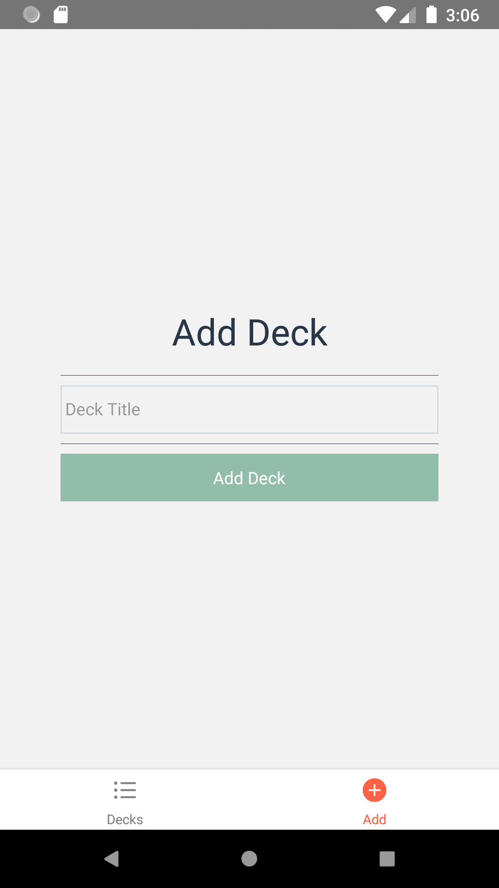
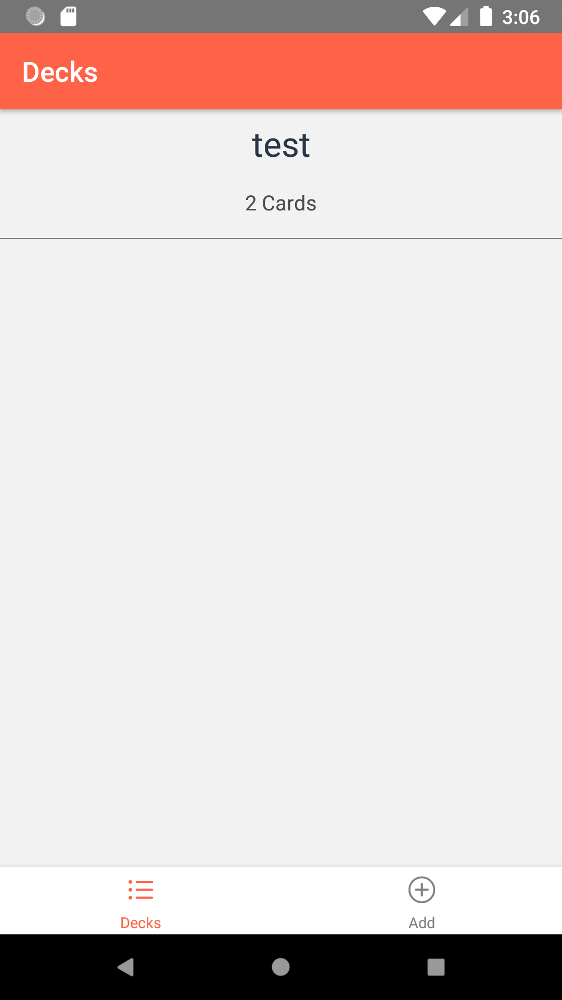
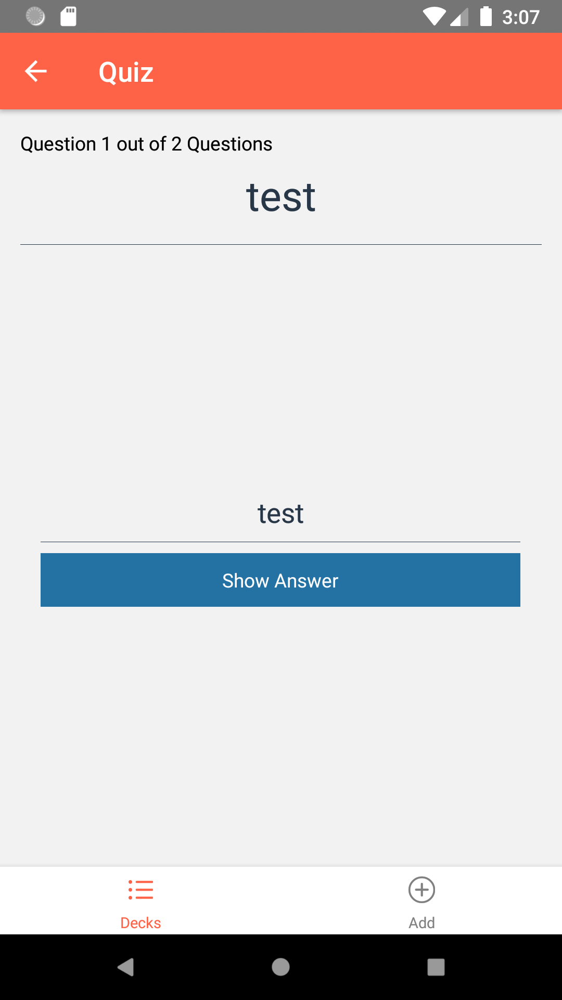

# Photos




# Prerequisites  
* Android Studio.
* Node Server.
* Yarn.
* Add New environment variable called `ANDROID_HOME` and it's value `C:\Users\USER\AppData\Local\Android\Sdk`.
* Add these values to Path variable.
    * `C:\Users\USER\GV9Jm2u7rmsCe65wKzPTw5jtS38n2tVEGi-tools`.
    * `C:\Users\USER\AppData\Local\Android\Sdk\tools`.
    * `C:\Users\USER\AppData\Roaming\npm`.
* Open android studio and create new virtual device.


# Create a New Project
* In powershell type `create-react-native-app {project name}`.

# To Run
* In powershell type `cd {project name}`.
* `react-native run-android` or `react-native run-ios`.

# Data
## Deck Sample
```javascript
{
  React: {
    title: 'React',
    questions: [
      {
        question: 'What is React?',
        answer: 'A library for managing user interfaces'
      },
      {
        "question": 'Where do you make Ajax requests in React?',
        answer: 'The componentDidMount lifecycle event'
      }
    ]
  }
}
```
